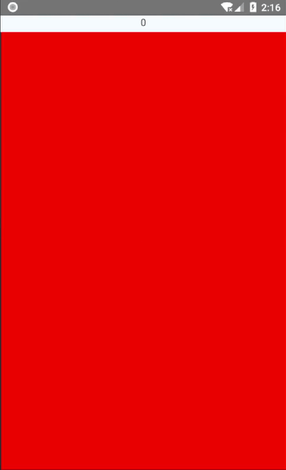

# 简单的视频播放器上层手势组件
- 此组件见实现了手势识别功能，具体的根据手势而回调的功能为实现
- 此组件支持：点击事件，左侧纵向滑动，右侧纵向滑动，全组建横向滑动等操作的识别。
## 使用简介

- `onClick`点击事件
- `onProgress`横向滑动中回调
- `onProgressEnd`横向滑动结束回调
- `onLeftProgress`左侧纵向滑动中回调
- `onLeftProgressEnd`左侧纵向滑动结束回调
- `onRightProgress`右侧纵向滑动中回调
- `onRightProgressEnd`右侧纵向滑动结束回调
```javascript
<VideoOperationComponet
    style={styles.sliding_view}
    onClick={()=>{
        this.setState({
            distance:"点击事件"
        })
    }}
    onProgress={(d)=>{
        this.setState({
            distance:"进度："+d
        })
    }}
    onProgressEnd={(d)=>{
        this.setState({
            distance:"进度结束："+d
        })
    }}
    onLeftProgress={(d)=>{
        this.setState({
            distance:"左进度："+d
        })
    }}
    onLeftProgressEnd={(d)=>{
        this.setState({
            distance:"左进度结束："+d
        })
    }}
    onRightProgress={(d)=>{
        this.setState({
             distance:"右进度："+d
        })
    }}
    onRightProgressEnd={(d)=>{
        this.setState({
             distance:"右进度结束："+d
        })
    }}
 >
</VideoOperationComponet>
```
- 支持自定义 有自定义需求的可参考`VideoOperationComponet`组件的实现
## 效果预览

